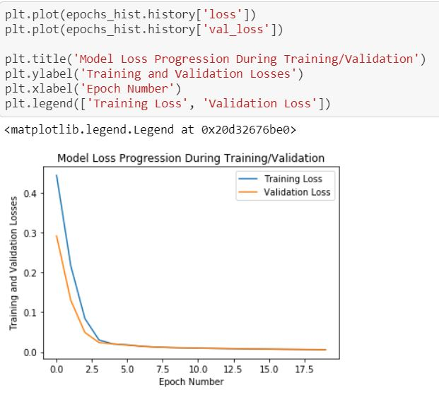

# car-price
1.Regression problem because output(dependent feature) is continous

2.No outlier in dataset and all independent features follow normal distribution

3.Dropped unnecessary features

4.independent feature and dependent feature performed feature scaling to avoid highly depend on this feature and results get quickly

5.consider minmax feature scaling (0-1) because using artificial neural networks (ANN).

6.vaildation loss is 0.0062

7.good fit because low bias and low variance

